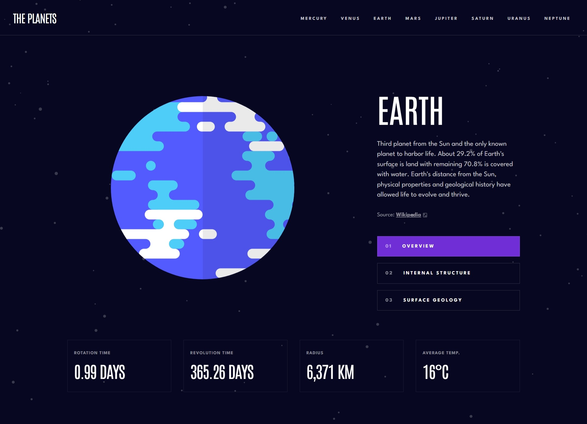

# Frontend Mentor - Planets fact site solution

This is a solution to the [Planets fact site challenge on Frontend Mentor](https://www.frontendmentor.io/challenges/planets-fact-site-gazqN8w_f). Frontend Mentor challenges help you improve your coding skills by building realistic projects.

## Table of contents

- [Frontend Mentor - Planets fact site solution](#frontend-mentor---planets-fact-site-solution)
  - [Table of contents](#table-of-contents)
  - [Overview](#overview)
    - [The challenge](#the-challenge)
    - [Screenshot](#screenshot)
    - [Links](#links)
  - [My process](#my-process)
    - [Built with](#built-with)
    - [What I learned](#what-i-learned)
  - [Author](#author)

## Overview

### The challenge

Users should be able to:

- View the optimal layout for the app depending on their device's screen size
- See hover states for all interactive elements on the page
- View each planet page and toggle between "Overview", "Internal Structure", and "Surface Geology"

### Screenshot

### Links

- Solution URL: [https://github.com/kamiliano1/planets-facts-site](https://github.com/kamiliano1/planets-facts-site)
- Live Site URL: [https://planets-facts-site-xi.vercel.app/](https://planets-facts-site-xi.vercel.app/)

## My process

### Built with

- Semantic HTML5 markup
- CSS custom properties
- Flexbox
- CSS Grid
- Mobile-first workflow
- [React](https://reactjs.org/) - JS library
- [Next.js](https://nextjs.org/) - React framework
- [radix-ui](https://www.radix-ui.com/)
- [Tailwind CSS](https://tailwindcss.com/)
- [clsx](https://www.npmjs.com/package/clsx)

### What I learned

During this project I implemented Next JS dynamic routing and the layout feature.

To improve accessibility:

- radix-ui/react-navigation-menu Navigation and Main bar

## Author

- Website - [Kamil Szymon](https://github.com/kamiliano1)
- Frontend Mentor - [@kamiliano1](https://www.frontendmentor.io/profile/kamiliano1)
- Twitter - [@Kamil9821030111](https://twitter.com/Kamil9821030111)
